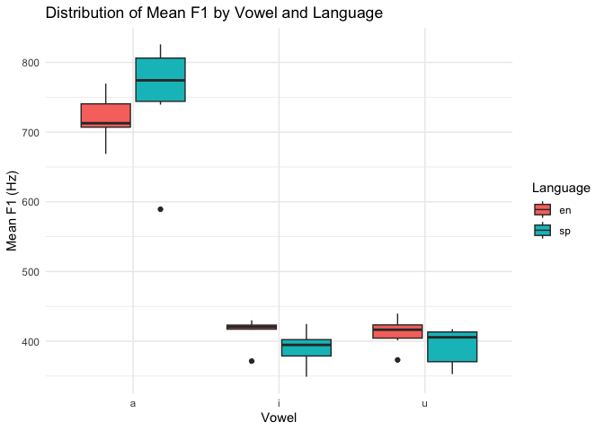
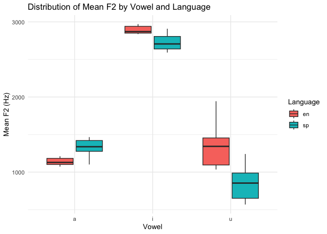
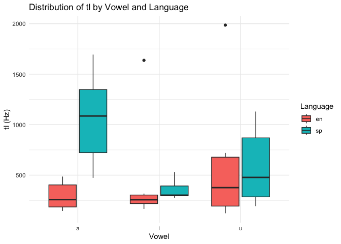
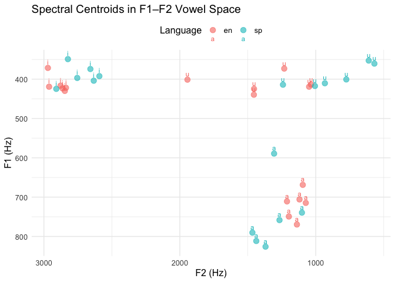

# Programming assignment 3

2025-11-06

``` r
# install.packages(c("tidyverse"))  # run once if needed

library(tidyverse)
```

    ── Attaching core tidyverse packages ──────────────────────── tidyverse 2.0.0 ──
    ✔ dplyr     1.1.4     ✔ readr     2.1.5
    ✔ forcats   1.0.1     ✔ stringr   1.5.1
    ✔ ggplot2   4.0.0     ✔ tibble    3.3.0
    ✔ lubridate 1.9.4     ✔ tidyr     1.3.1
    ✔ purrr     1.1.0     
    ── Conflicts ────────────────────────────────────────── tidyverse_conflicts() ──
    ✖ dplyr::filter() masks stats::filter()
    ✖ dplyr::lag()    masks stats::lag()
    ℹ Use the conflicted package (<http://conflicted.r-lib.org/>) to force all conflicts to become errors

``` r
# Path to the CSV created by your Praat script

dat <- read_csv("data/vowel_data.csv", show_col_types = FALSE)

# Peek at structure

glimpse(dat)
```

    Rows: 36
    Columns: 17
    $ id       <lgl> NA, NA, NA, NA, NA, NA, NA, NA, NA, NA, NA, NA, NA, NA, NA, N…
    $ item     <chr> "meet", "beat", "feet", "seat", "heat", "fleet", "moss", "bot…
    $ vowel    <chr> "i", "i", "i", "i", "i", "i", "a", "a", "a", "a", "a", "a", "…
    $ language <chr> "en", "en", "en", "en", "en", "en", "en", "en", "en", "en", "…
    $ f1_cent  <dbl> 429.97, 371.46, 416.61, 423.46, 419.27, 421.98, 705.86, 749.2…
    $ f2_cent  <dbl> 2846.18, 2970.59, 2877.73, 2862.79, 2961.82, 2837.46, 1119.56…
    $ tl       <dbl> 1637.10, 260.87, 207.18, 251.73, 165.65, 317.40, 485.99, 199.…
    $ f1_20    <dbl> 419.89, 388.63, 401.18, 417.79, 413.00, 413.15, 762.89, 684.7…
    $ f1_35    <dbl> 426.69, 390.53, 403.81, 419.44, 408.81, 416.84, 854.80, 691.4…
    $ f1_50    <dbl> 438.16, 392.67, 414.32, 417.77, 404.98, 422.01, 666.91, 776.1…
    $ f1_65    <dbl> 471.57, 365.53, 433.53, 421.49, 432.51, 418.49, 592.84, 807.2…
    $ f1_80    <dbl> 393.57, 319.94, 430.20, 440.83, 437.06, 439.42, 651.87, 786.6…
    $ f2_20    <dbl> 2887.63, 2838.04, 2758.78, 2719.87, 2998.78, 2650.50, 1084.68…
    $ f2_35    <dbl> 3108.10, 2961.37, 2858.29, 2814.07, 2976.36, 2760.04, 1099.15…
    $ f2_50    <dbl> 3185.15, 3024.25, 2897.37, 2937.64, 2981.56, 2879.85, 1077.58…
    $ f2_65    <dbl> 3175.79, 3014.01, 2944.89, 2927.67, 2980.56, 2937.96, 1187.89…
    $ f2_80    <dbl> 1874.21, 3015.31, 2929.33, 2914.68, 2871.82, 2958.97, 1148.53…

``` r
# Make sure expected columns exist:

# id, item, vowel, language, f1_cent, f2_cent, tl, f1_20...f2_80

stopifnot(all(c("id","item","vowel","language","f1_cent","f2_cent","tl") %in% names(dat)))

# Optional: order vowels (edit to your inventory)

dat <- dat %>%
mutate(
vowel = factor(vowel),
language = factor(language)
)

#| label: descriptives
descriptives <- dat %>%
group_by(language, vowel) %>%
summarise(
n        = n(),
mean_f1  = mean(f1_cent, na.rm = TRUE),
sd_f1    = sd(f1_cent, na.rm = TRUE),
se_f1    = sd_f1 / sqrt(n),
mean_f2  = mean(f2_cent, na.rm = TRUE),
sd_f2    = sd(f2_cent, na.rm = TRUE),
se_f2    = sd_f2 / sqrt(n),
mean_tl  = mean(tl, na.rm = TRUE),
sd_tl    = sd(tl, na.rm = TRUE),
se_tl    = sd_tl / sqrt(n),
.groups = "drop"
)
```

``` r
ggplot(dat, aes(x = vowel, y = f1_cent, fill = language)) +
  geom_boxplot() +
  labs(
    title = "Distribution of Mean F1 by Vowel and Language",
    x = "Vowel",
    y = "Mean F1 (Hz)",
    fill = "Language"
  ) +
  theme_minimal()
```



``` r
ggplot(dat, aes(x = vowel, y = f2_cent, fill = language)) +
  geom_boxplot() +
  labs(
    title = "Distribution of Mean F2 by Vowel and Language",
    x = "Vowel",
    y = "Mean F2 (Hz)",
    fill = "Language"
  ) +
  theme_minimal()
```



``` r
ggplot(dat, aes(x = vowel, y = tl, fill = language)) +
  geom_boxplot() +
  labs(
    title = "Distribution of tl by Vowel and Language",
    x = "Vowel",
    y = "tl (Hz)",
    fill = "Language"
  ) +
  theme_minimal()
```



``` r
library(ggplot2)

ggplot(dat, aes(x = f2_cent, y = f1_cent, color = language, label = vowel)) +
  # Plot each token as a point
  geom_point(alpha = 0.6, size = 3) +
  # Add vowel labels (optional)
  geom_text(vjust = -0.7, size = 3) +
  # Invert axes to match standard vowel space
  scale_x_reverse() +
  scale_y_reverse() +
  labs(
    title = "Spectral Centroids in F1–F2 Vowel Space",
    x = "F2 (Hz)",
    y = "F1 (Hz)",
    color = "Language"
  ) +
  theme_minimal() +
  theme(
    text = element_text(size = 12),
    legend.position = "top"
  )
```


